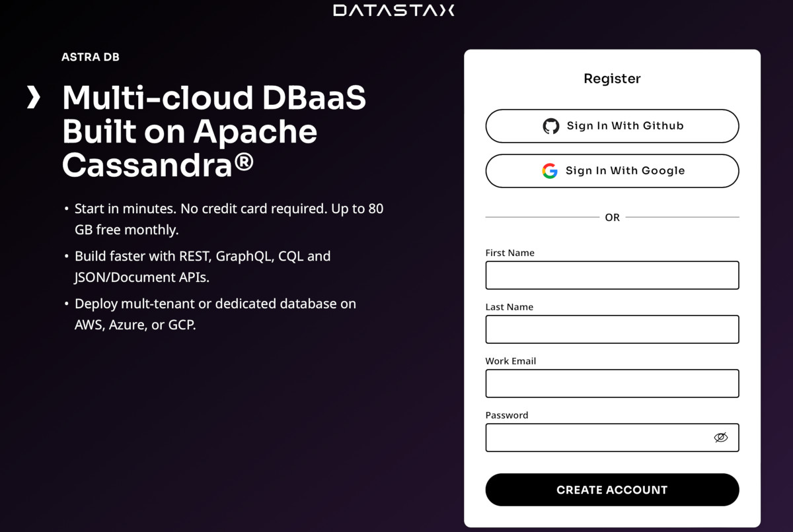
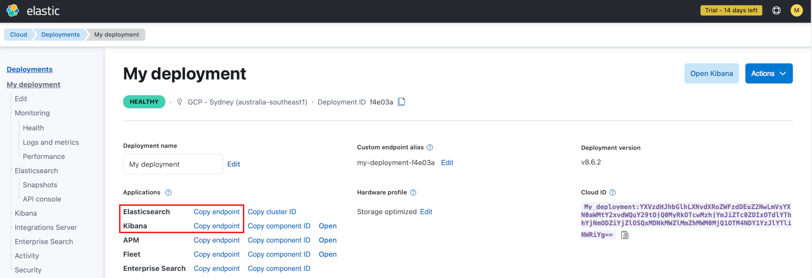
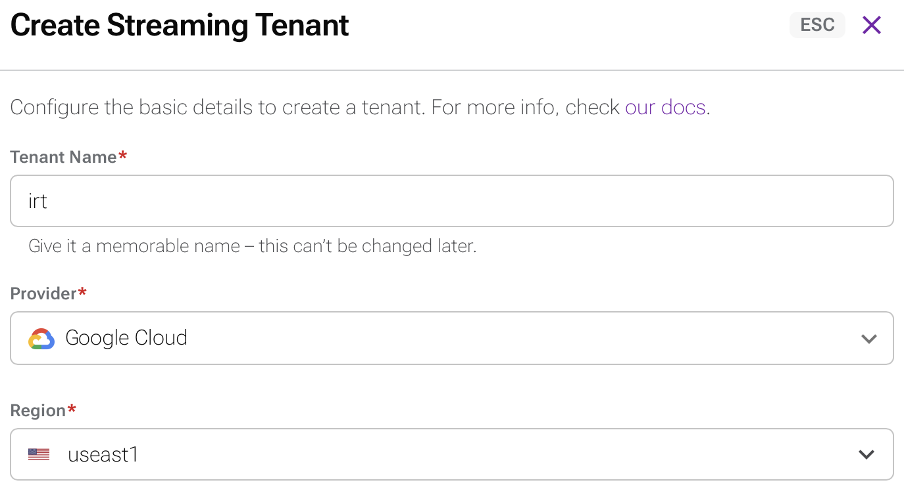
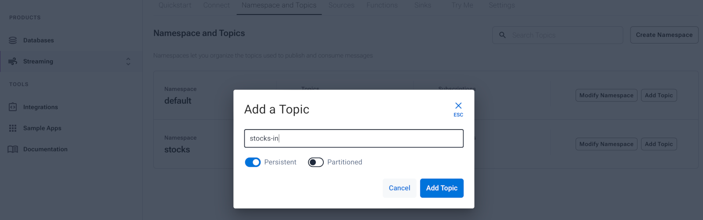
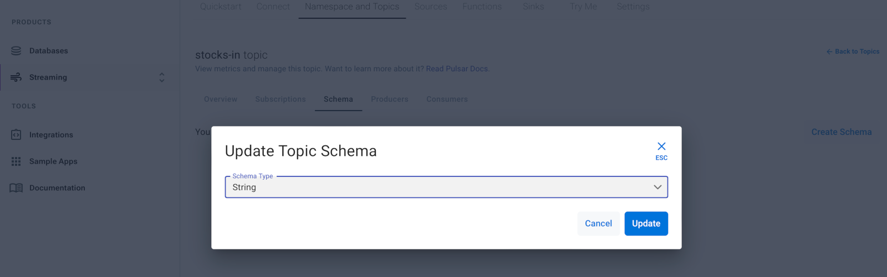
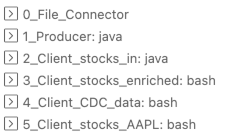
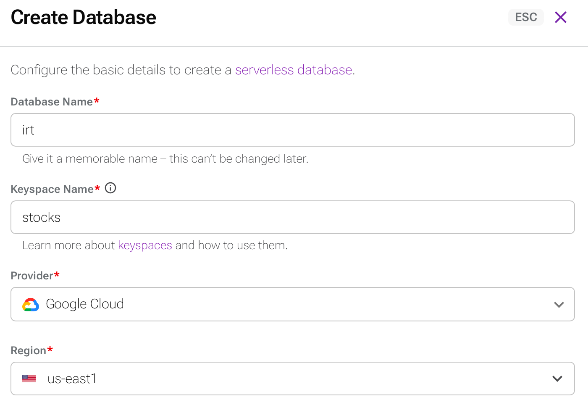
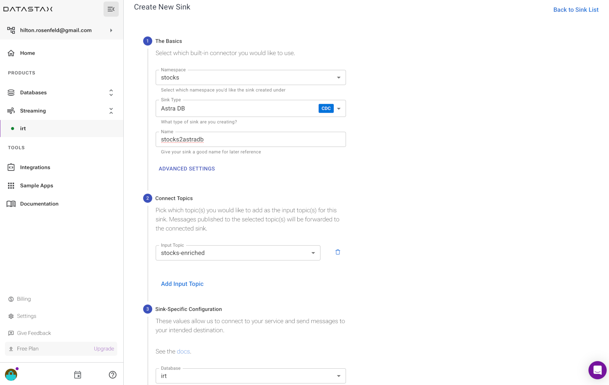
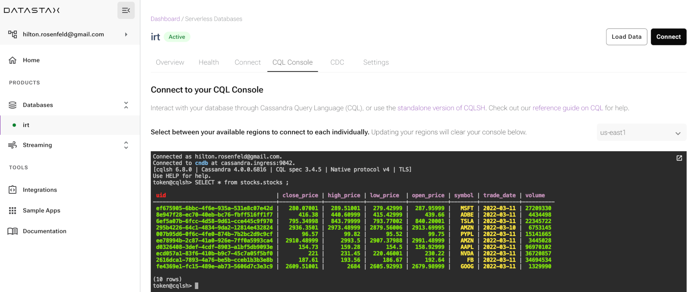
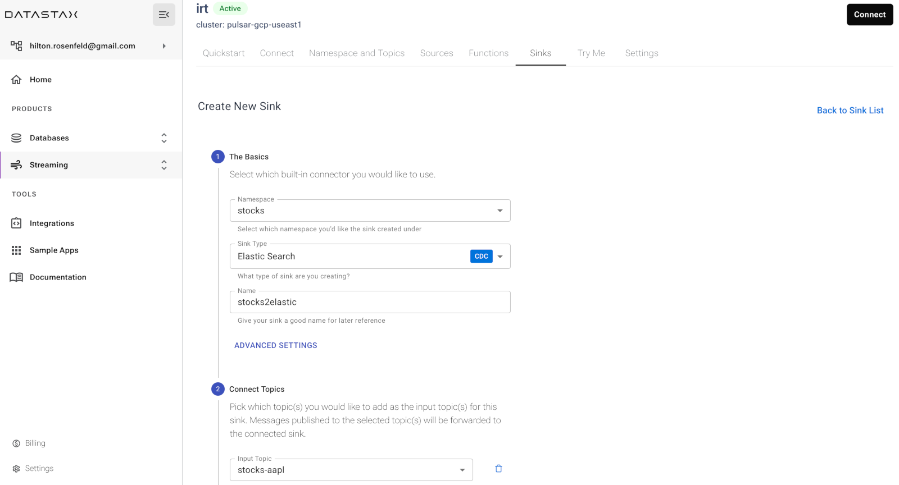

# Data Pipeline Workshop

This workshop will provide good exposure to the tools and processes needed to create a complete data stream from source to target. The stream you will create is a simulation of a stock trade data stream.
We will use Astra Streaming topics/functions/sinks, the Pulsar CLI, file data sources, Astra DB with CDC, and finally ElasticSearch.

The process you will follow for this workshop is as follows:
    
- Incoming data will come from a file that will be consumed from a CSV file using the Pulsar CLI and published to an Astra Streaming topic.  This will provide experience in using the Pulsar CLI to interact with Astra.
- We will deploy a function that will enrich the messages, and store them in Astra DB using a sink.
- CDC will detect changes in the Astra DB table and publish them to a data topic in Astra Streaming.
- We will deploy a function that filters messages and publishes them to multiple topics based on their content.
- Messages from those topics will be consumed with sinks to ElasticSearch.


## 1. Prerequisites
To execute this workshop, ensure that you have the following:

<!--
* Java 11 installed
- Pulsar CLI from [Pulsar 2.10.x](https://github.com/datastax/pulsar/releases/download/ls210_4.0/lunastreaming-2.10.4.0-bin.tar.gz)-->
- A [GitHub](https://github.com/) account
- An [Astra](https://astra.datastax.com) account
- An [ElasticSearch](https://www.elastic.co/) account

### 1.1 GitHub
If you do not have a GitHub account, create a free account at [GitHub](https://github.com/signup).


### 1.2 DataStax Astra
If you do not have an Astra account, create a free trial account at [Astra Registration](https://astra.datastax.com/register).




### 1.3 ElasticSearch
If you do not have an ElasticSearch account, create a free trial account at [ElasticSearch](https://www.elastic.co/) and then:
- create a deployment in the uscentral1 GCP region.  <b>Be sure to save the credentials that are provided</b> as you'll need them later.
- click on your deployment in the menu on the left.
- Take note of the following items as you'll need them in later steps:
    - ElasticSearch endpoint
    - Kibana endpoint




## 2. Setup
In this section, we will walk through setup of the tools needed to execute this workshop.  This includes forking the DataStax GitHub repository for this workshop, opening your fork of the repository in GitPod, configuring the Pulsar CLI, our Astra DB table, and ElasticSearch.

### 2.1 Fork the GitHub repository

1. Login to your GitHub account

2. Navigate to the GitHub repository for this workshop
    - `https://github.com/in-realtime/data-pipelines`

3. In the top-right corner of the page, click **Fork**.
    

4. Select an owner for the forked repository.

5. By default, the fork will be named the same as the original. You can change the name of the fork if you prefer.

6. Click `Create fork`.


### 2.2 Open your repository in GitPod

1. In a browser, navigate to your fork of the GitHub repository that you created above.

2. In the browser’s address bar, prefix the entire URL with `gitpod.io/#` and press Enter.
    - For example, `gitpod.io/#https://github.com/hiltonrosenfeld/data-pipelines`
3. Click on the button `Continue with GitHub`.

4. Authorise GitPod to sign in with your GitHub account.

5. For Choose an Editor, select `VS Code • 1.x.x • Browser`.

6. There is no need to install the Extension Pack for Java.

<!--
### Pulsar CLI tools
1. Download the [Pulsar 2.10.x](https://github.com/datastax/pulsar/releases/download/ls210_4.0/lunastreaming-2.10.4.0-bin.tar.gz) archive. 
2. Extract the archive.
    ```sh
    tar zxf lunastreaming-2.10.4.0-bin.tar.gz
    ```
3. Make a note of this directory location as `<YOUR PULSAR DIR>`
4. Create the connectors directory:
    ```sh
    cd lunastreaming-2.10.4.0
    mkdir connectors
    ```
-->

### 2.3 Astra Streaming Tenant and Namespace
1. Login to your Astra account.

2. Create a Streaming Tenant
    1. Create a unique name for your tenant such as `irt-hilton`. We will refer to  this as `<TENANT>` in the remainder of this workshop.
    1. Navigate to *Streaming* in the Menu.
    2. Click the *Create Tenant* button.
    3. Create a streaming tenant using the following:
        * Tenant Name: `<TENANT>`
        * Provider: `Google Cloud`
        * Region: `useast1`
    
    

3. Create a Namespace & Topic
    1. Create Namespace 
        1. Navigate to *Streaming* in the Menu.
        2. Open the Streaming tenant you just created.
        3. Navigate to the *Namespace and Topics* tab.
        4. Click the *Create Namespace* button.
        5. Enter `stocks` as the Namespace Name.
    2. Create Topic
        1. Click the *Add Topic* button in the `stocks` Namespace.
        2. Enter `stocks-in` as the Topic Name.

        
    3. Create Schema
        - Open the `stocks-in` Topic.
        - Navigate to the *Schema* tab.
        - Click the *Create Schema* button.
        - Select `String` as the Schema Type.

        

4. Add Streaming Configuration to Pulsar CLI
    1. Download configuration file
        1. Navigate to the *Connect* tab.
        2. Click the *Download client.conf* button.
    2. Add *client.conf* to Pulsar CLI
        1. In GitPod, navigate to `tools/lunastreaming-2.10.4.0/conf`.
        2. Open the file `client.conf` and replace it's content with the file you just downloaded.
        3. Save the file


## 3. Creating the Data Pipeline

### 3.1 Astra Streaming from the Command Line

Your GitPod environment is preconfigured with  a number of Terminal sessions.
Each of this will be used for concurrently running multiple Pulsar CLI commands.



1. Create a **Consumer**
    1. Select the Terminal named `2_Consumer_stocks-in`
    2. Type cd tools/lunastreaming-2.10.4.0/bin
    3. Create the consumer using the following command. The `-s` option specifies your subscription name and the `-n 0` option tells the client to consume messages continuously.
        ```sh
        ./pulsar-client consume -s test -n 0 <TENANT>/stocks/stocks-in
        ```

2. Create a **Producer**
    1. Select the Terminal named `1_File_Connector`
    2. Type cd tools/lunastreaming-2.10.4.0/bin
    3. Create the producer using the following command.
    ```sh
        ./pulsar-client produce -m hello <TENANT>/stocks/stocks-in
    ```

3. Check the results
    1. Select the Terminal named `2_Consumer_stocks-in`

        You should see the message content `key:[null], properties:[], content:hello` as the output in the consumer's console.  At this point you have your first topic created and you have verified that you can connect to Astra Streaming and produce/consume messages.
    

### 3.2 File Source

Now that you have a topic that you can publish to, create a Pulsar file source connector and let it process an input file. You will specify a folder in which the connector will look for files.  

1. Collect the following information from your `client.conf` file:
    - \<TOKEN\>: **authParams**.
    - \<BROKER SERVICE URL\>: **brokerServiceUrl**.

2. In the `1_File_Connector` terminal,  set the following environment variables.
    - export BROKER_SERVICE_URL=**brokerServiceUrl in client.conf**.
    - export TOKEN=**authParams in client.conf**.
    - export TENANT=**Tenant used for the workshop**
       
4. Copy the following code snippet and paste into the `1_File_Connector` terminal.
    ```
    ./pulsar-admin sources localrun \
        --broker-service-url $BROKER_SERVICE_URL \
        --client-auth-plugin org.apache.pulsar.client.impl.auth.AuthenticationToken \
        --client-auth-params "$TOKEN" \
        --archive /workspace/data-pipelines/tools/lunastreaming-2.10.4.0/connectors/pulsar-io-file-2.10.3.nar \
        --name stocks-file-source \
        --destination-topic-name $TENANT/stocks/stocks-in \
        --source-config-file /workspace/data-pipelines/stock-price-file-connector.yaml
    ```
 
5. Trigger a file read
    1. Select the Terminal named `0_General`
    2. Place Data File
        ```sh
        mkdir /tmp/stocks
        cp stock-prices-10.csv /tmp/stocks
        ```

6. Check the results
    1. Select the Terminal named `2_Consumer_stock-in`
    
        You should see new messages output by the consumer.  There will be a message for each line in the file.


### 3.4 Enrichment Function

Next we will add a function to the stream.  This function will consume messages from the `stocks-in` topic, convert the message to a Java object, add a GUID, and then publish a message as a JSON schema.  You can find the function code in GitPod in `src/main/java/com/datastax/demo/function/AddUuidToStockFunction.java`.

1. Create a topic called `stocks-enriched` in your stocks namespace.

2. Compile the Java enriching function
    1. Select the Terminal named `0_General`
    2. compile th function using the following commands:
        ```sh
        ./mvnw clean install
        ```
        This will create a jar file in the GitPod `target` directory.
    3. Download the jar file.

3. Create an Astra Streaming Function
    1. Navigate to the `Functions` tab of your streaming tenant.
    2. Click the *Create Function* button.
    3. Create the function using:
        - Name Your Function
            - Function Name: `enrichfunction`
            - Namespace: `stocks`
        - Upload Your Code
            - Upload my own code
            - Select the file `function-demo-0.0.1-SNAPSHOT.jar`
            - Choose a function: `AddUuidToStockFunction`
        - Choose Input Topics
            - Namespace: `stocks`
            - Input Topic: `stocks-in`
        - Choose Destination Topics
            - Namespace: `stocks`
            - Output Topic: `stocks-enriched`
        - Leave the advanced configuration items set to the defaults.
    4. You can watch the startup of your function by clicking the name and scrolling to the bottom where the logs are displayed.

4. Create a **consumer** for `stocks-enriched`
    1. Select the Terminal named `3_Consumer_stocks-enriched`
    2. Create the consumer using the following command:
        ```sh
        ./pulsar-client consume -s test -n 0 <TENANT>/stocks/stocks-enriched
        ```
5. Trigger a file read
    1. Select the Terminal named `0_General`
    2. Place Data File
        ```sh
        cp stock-prices-10.csv /tmp/stocks
        ```
6. Check the results
    1. Select the Terminal named `2_Consumer_stock-in`

        You should see new messages.  There will be a message for each line in the file.
    2. Select the Terminal named `3_Consumer_stock-enriched`
    
        You should see messages we just created.  They should be in JSON format.


### 3.5 Storing Data in Astra DB

The messages that are created by consuming the stock file and then enriched by the first function will be inserted into a table in Astra DB. 

1. Login to your Astra account.

2. Create a Database
    1. Navigate to *Databases* in the Menu.
    2. Click the *Create Database* button.
    3. Create the database using the following:
        * Database Name: `irt`
        * Keyspace Name: `stocks`
        * Provider: `Google`
        * Region: `us-east1`
        
    

3. Generate a Token
    1. Click the Generate Token button.
    2. Click on Download Token Details.
    3. Open the downloaded file irt-token.json and verify that you can read the file.

4. Create the `stocks` Table
    1. Navigate to the `CQL Console` tab
    2. Paste the following CQL command into the CQL Console:
        ```sql
        create table stocks.stocks ( 
            uid uuid primary key,
            symbol text, 
            trade_date text, 
            open_price float, 
            high_price float, 
            low_price float, 
            close_price float, 
            volume int 
        );
        ```
    3. DO NOT enable CDC on this table yet.

5. Create a Sink
    1. Navigate to *Streaming* in the Menu.
    2. Open the your Streaming tenant.
    3. Navigate to the *Sinks* tab
    4. Click the *Create Sink* button.
    5. Create the sink using the following:
        - The Basics
            - Namespace: `stocks`
            - Sink Type: `Astra DB`
            - Name: `stocks2astradb`
        - Connect Topics
            - Input Topics: `stocks-enriched`
        - Sink-Specific Configuration
            - Database: `irt`
            - Token: `<YOUR ASTRA DB TOKEN>`
            - Keyspace: `stocks`
            - Table Name: `stocks`
            - Mapping: `uid=value.uuid,symbol=value.symbol,trade_date=value.date,open_price=value.openPrice,high_price=value.highPrice,low_price=value.lowPrice,close_price=value.closePrice,volume=value.volume`
    
        

6. Trigger a file read
    1. Select the Terminal named `0_General`
    2. Place Data File
        ```sh
        cp stock-prices-10.csv /tmp/stocks
        ```

7. Validate the data flow into the `stocks` table
    1. Navigate to *Databases* in the Menu.
    2. Open the `irt` Database.
    3. Navigate to the `CQL Console` tab
    4. Paste the following CQL query into the CQL Console:
        ```sql
        select * from stocks.stocks;
        ```
    


### 3.6 Change Data Capture 

Now that we have a table holding enriched stock data, let's enable CDC and look at what gets created.
1. Enable CDC
    1. Navigate to *Databases* in the Menu.
    2. Open the `irt` Database.
    3. Navigate to the `CDC` tab
    4. Click the *Enable CDC* button
    5. Enable CDC using the following:
        - Tenants: `pulsar-gcp-east1 / irt`
        - Keyspace: `stocks`
        - Table Name: `stocks`
    
    

2. Get the CDC Data topic name
    1. Navigate to *Streaming* in the Menu.
    2. Open the your Streaming tenant.
    3. Navigate to the `Namespaces and Topics` tab.
        - notice that there is a new Namespace created by enabling CDC: `astracdc`.
    4. Expand the `astracdc` Namespace.
        - You should see a data topic and a log topic.
    5. Copy the name of the data topic for the next step.    

3. Create a **consumer** for the CDC Data topic
    1. Select the Terminal named `4_Consumer_CDC-Data`
    2. Create the consumer using the following command:
        ```sh
        cd /workspace/data-pipelines/tools/lunastreaming-2.10.4.0/bin
        ./pulsar-client consume -s test -n 0 <TENANT>/astracdc/data-xxxxxxxxxxxxxxxxx.stocks
        ```
4. Trigger a file read
    1. Select the Terminal named `0_General`
    2. Place Data File
        ```sh
        cp stock-prices-10.csv /tmp/stocks
        ```

6. Check the results
    1. Select the Terminal named `4_Consumer_CDC-Data`

        You should see 10 new messages.


### 3.7 Stock Routing Function
The last part of the stream prior to sending data to external systems is to create the routing function in Astra Streaming.  This function will consume data from the CDC data topic and publish a new message to a topic that corresponds to the symbol in the message.

1. Create stock specific Topics
    1. Navigate to *Streaming* in the Menu.
    2. Open the your Streaming tenant.
    3. Navigate to the *Namespace and Topics* tab.
    4. Click the *Add Topic* button in the `stocks` Namespace.
        1. Enter `stocks-default` as the Topic Name.
    5. Repeat for each of:
        - `stocks-aapl`
        - `stocks-goog`

2. Routing Function
    
    Look at the routing function code in GitPod in `src/main/java/com/datastax/demo/function/FilterStockByTicker.java`

    This code provides an example of how you can publish messages to multiple topics from one function.  It works by looking at the stock symbol field of the incoming message and filters based on the value.  It will pass all messages that match AAPL to the "stocks-aapl" topic and all messages that match "GOOG" to the "stocks-goog" topic.
    
    1. Edit the Function

        Lines 15 and 18 must be changed to refer to your Streaming tenant name. Replace  \<TENANT\> with the correct name:

        ```java
        private static String APPLE_TOPIC = "persistent://<TENANT>/stocks/stocks-aapl";
        private static String GOOGLE_TOPIC= "persistent://<TENANT>/stocks/stocks-goog";
        ```

3. Compile the class
    1. Select the Terminal named `0_General`
    2. compile th function using the following commands:
        ```sh
        ./mvnw clean package
        ```
        This will create a jar file in the GitPod `target` directory.
    3. Download the jar file.

4. Create an Astra Streaming Function from the compiled class
    1. Navigate to the `Functions` tab of your streaming tenant.
    2. Click the *Create Function* button.
    3. Create the function using:
        - Name Your Function
            - Function Name: `routingfunction`
            - Namespace: `stocks`
        - Upload Your Code
            - Upload my own code
            - Select the file `function-demo-0.0.1-SNAPSHOT.jar`
            - Choose a function: `FilterStockByTicker`
        - Choose Input Topics
            - Namespace: `astracdc`
            - Input Topic: `data-xxxxxxxxxxxxxxxxx.stocks`
        - Choose Destination Topics
            - Namespace: `stocks`
            - Output Topic: `stocks-default`
        - Leave the advanced configuration items set to the defaults.
    4. You can watch the startup of your function by clicking the name and scrolling to the bottom where the logs are displayed.

5. Create a **consumer** for `stocks-aapl`
    1. Select the Terminal named `5_Consumer_stocks-aapl`
    2. Create the consumer using the following command:
        ```sh
        ./pulsar-client consume -s test -n 0 <TENANT>/stocks/stocks-aapl
        ```
6. Trigger a file read
    1. Select the Terminal named `0_General`
    2. Place Data File
        ```sh
        cp stock-prices-10.csv /tmp/stocks
        ```

6. Check the results
    1. Select the Terminal named `5_Consumer_stocks-aapl`

        You should see 1 new messages.


### 3.8 Send Data to ElasticSearch
The ElasticSearch sink is a built in connector for Astra Streaming.  From the setup step where you created an ElasticSearch account, you'll need the following values in order to create the sink.

- Elastic Endpoint URL
- Username / Password

1. Create a Sink to Elasticsearch
    1. Navigate to *Streaming* in the Menu.
    2. Open the your Streaming tenant.
    3. Navigate to the *Sinks* tab
    4. Click the *Create Sink* button.
    5. Create the sink using the following:
        - The Basics
            - Namespace: `stocks`
            - Sink Type: `Elastic Search`
            - Name: `stocks2elastic`
        - Connect Topics
            - Input Topics: `stocks-aapl`
        - Sink-Specific Configuration
            - Elastic Search URL: `<Elastic Endpoint URL>`
            - Index Name: `appl-index`
            - Username: `<Elastic Username>`
            - Password: `<Elastic Password>`
                - You can skip the token and API key fields
            - Ignore Record Key: Disabled
            - Strip Nulls: Disabled
            - Enable Schemas: Disabled
            - Copy Key Fields: Enabled
            - Mapping: `uid=value.uuid,symbol=value.symbol,trade_date=value.date,open_price=value.openPrice,high_price=value.highPrice,low_price=value.lowPrice,close_price=value.closePrice,volume=value.volume`
            
        - For all other values, you can leave them set to the defaults.

        

    6. Click the sink name on the following page and you can see the configuration and logs for the sink as it's being created.

2. Trigger a file read
    1. After the sink is running...
    2. Select the Terminal named `0_General`
    3. Place Data File
        ```sh
        cp stock-prices-10.csv /tmp/stocks
        ```

3. Validate the data flow into Elasticsearch
    1. Log in to [Elasticsearch](https://cloud.elastic.co/)
    2. Open your Elasticsearch Service Deployment
    3. Click on *Enterprise Search*.  
    4. Click *Indices* in the menu.
    5. Open the index called `appl-index`.
    5. Click on the *Documents* tab.
    
    You will see records that were sent through the AAPL topic by the routing function created in the previous step.
